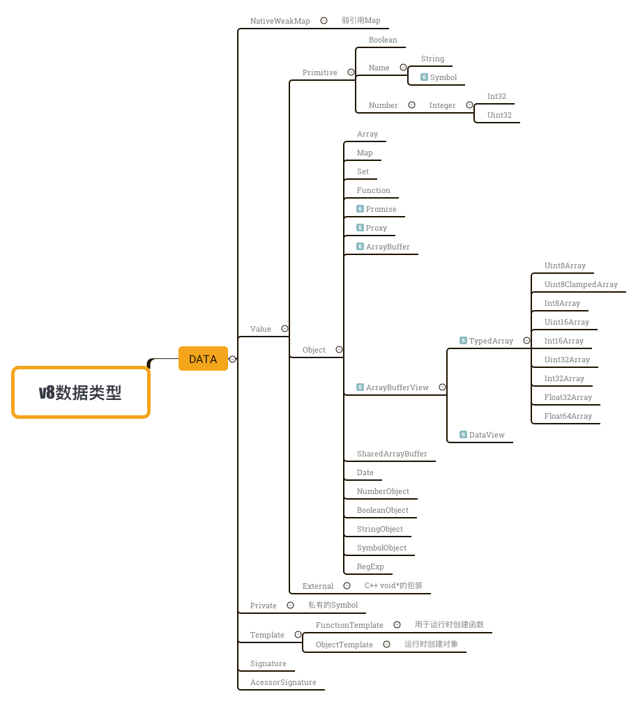

# 1.1 Memory Heap/Stack(内存堆栈)
js引擎中对变量的存储主要有两种位置,堆内存和栈内存。由此对应了两大数据类型：
- 基本数据类型（Primitive）：Boolean、null、undefined、String、Number、Symbol(ES6)
- 引用数据类型（Object）：Array、Function、Object、RegExp、(Number|Boolean|String|Symbol)Object、Map(ES6)、Set(ES6)、Promise(ES6)、Date()、浏览器内置对象等。

为什么要分成堆内存和栈内存来存放变量呢？在计算机的数据结构中，栈比堆的运算速度更快，那么是否都能放在栈内存中呢？答案是否定的。像Array/Object等这种类型，其值的大小不固定，还能拓展，这种情景下不能把它们保存到栈内存中。因此需要将变量分成堆内存和栈内存来存放，然而引用类型的内存地址大小的固定的，因此这部分可以放在栈内存中。

堆内存和栈内存的区别不仅体现在引用和复制、赋值上，在内存分配和垃圾回收中也有着明显区别。这将在后续篇章进行详细介绍。
需要注意的一点是，栈内存不仅存储着各种基本类型的变量，还存放着对象变量的指针(访问地址)，在查询引用类型变量时，先从栈中读取变量指针，再通过地址找到堆中的值，这个过程称为按引用访问。

V8引擎中的数据类型结构如下。


js里每个基本数据类型在v8里都有对应的类实现。我们知道，作为动态语言的js在编译时不能确定变量的类型，只能在执行时确定。在运行时计算和决定类型是会降低运行效率的原因。V8使用了一种特殊的方法：数据的内部表示由数据的实际内容和数据的句柄构成。数据的实际内容长度可变，类型可变；数据的句柄固定大小，包含指向数据的指针。变量存取时通过查找、修改句柄中的指针即可。

## 1.1.1 基本数据类型
### Q1.`typeof null === typeof {}`的结果及其原因
结果一目了然，返回`true`，因为两个typeof的结果都是`"object"`，那么为什么`typeof null`的结果是object而不是null呢？可以说是早期js的bug。

#### 数值存储标识
数值是以32字节存储的，由标志位（1~3个字节）和数值组成。标志位存储的是低位的数据。这里有五种标志位
- `000`：对象，数据是对象的应用。
- `1`：整型，数据是31位带符号整数。
- `010`：双精度类型，数据是双精度数字。
- `100`：字符串，数据是字符串。
- `110`：布尔类型，数据是布尔值。

有 2 个值比较特殊：
- `undefined`：用`（?2^30）`表示。
- `null`：对应机器码的 NULL 指针，一般是全零。

#### 数值判断
在早期的js引擎判断中，typeof进行数据类型的判断规则如下
``` c
if (JSVAL_IS_VOID(v)) {  // (1)
    type = JSTYPE_VOID;
} else if (JSVAL_IS_OBJECT(v)) {  // (2)
    obj = JSVAL_TO_OBJECT(v);
    if (obj &&
        (ops = obj->map->ops,
            ops == &js_ObjectOps
            ? (clasp = OBJ_GET_CLASS(cx, obj),
            clasp->call || clasp == &js_FunctionClass) // (3,4)
            : ops->call != 0)) {  // (3)
        type = JSTYPE_FUNCTION;
    } else {
        type = JSTYPE_OBJECT;
    }
} else if (JSVAL_IS_NUMBER(v)) {
    type = JSTYPE_NUMBER;
} else if (JSVAL_IS_STRING(v)) {
    type = JSTYPE_STRING;
} else if (JSVAL_IS_BOOLEAN(v)) {
    type = JSTYPE_BOOLEAN;
}
```

步骤可以理解为：
- 第一步，判断是否为 undefined；
- 第二步，如果不是 undefined，判断是否为对象；
- 第三步，如果不是对象，判断是否为数字；
- 第四步，如果不是数字，判断是否为字符串；
- 第五步，如果不是字符串，判断是否为布尔值。

这样来看，在typeof判断`null`的时候，第一步判断是否undefined时，标志位不匹配，到第二步，全是`0`的null符合`000`的标志，因为判断结果为对象。很是尴尬。

#### 后续会修改吗
个人觉得如果修改此判断的话会大范围影响早期网站。比如某网站对变量判断如下：
``` js
/**
 * 判断是否为false/null/undefined，虽然不推荐这么判断不过相信有这么写的
 * @param val {any} 变量
 * @return {Boolean}
 */
function isNoVal(val) {
	let _type = typeof val;
	if (!value && 
		(_type === 'boolean' || _type === 'object' || _type === 'undefined')
	) {
		return true;
	} else {
		return false;
	}
}
```

这种情况下如果typeof null 值为'null'的话那返回就是false了。


在 ES6 中也曾有关于修复此 bug 的提议，提议中称应该让`typeof null === 'null'`。但是该提议被无情的否决了，自此 typeof null 终于不再是一个 bug，而是一个 feature，并且永远不会被修复。

归纳：
- 关键词：**类型判断**
- 可拓展内容：几种比较方式的使用场景、比较和实现原理（`typeof`、`instanceof`、`Object.prototype.toString.call`、`Object.is`）。


### Q2.`var str1 = 'string', str2 = String('string'), str3 = new String('string');`，变量`str1`、`str2`和`str3`结果是相同的吗？如果不相同可能通过处理使其相同吗？

先上结果，`str1`和`str2`结果相同，但它们和`str3`不相同。
`str1`是最直接的字符变量赋值操作，结果是字符串`string`，`str2`是通过String构造函数进行字符串赋值操作，其结果也是字符串`string`，而通过new操作符定义的`str3`结果是什么呢？它返回一个对象，存取字符串、数字或者布尔值的属性时创建的临时对象称作包装对象。

`str3`在Chrome中打印如下：
``` 
String {"string"}
0: "s"
1: "t"
2: "r"
3: "i"
4: "n"
5: "g"
length: 6
__proto__: String
[[PrimitiveValue]]: "string"
```

既然`str3`是引用类型，那么它自然就跟字符类型不相等了。

那么`str3`还有机会转为我们所需要的字符串吗？答案是肯定的。我们可以通过`valueOf()`或`toString()`方法进行转换（`toString()`本身也会进行一步`valueOf()`，其转换规则见后文1.1.3类型转换）：
``` js
str3 = str3.valueOf();

// or
str3 = str3.toString();

console.log(str3);	// 'string'
```


关于new操作符后续操作符篇章会有更为详细的介绍，在此就不展开了。最后点一下隐式包装对象。

#### 隐式包装对象
基本类型本身不具备操作方法，就像字符串`str1`，它本身并不具备`slice()`、`charCodeAt()`等等字符操作方法，但我们为什么可以直接像`str1.slice(1, 3)`这样直接使用呢，这就涉及到一个隐式的转换，js引擎会隐式创建的包装对象，包装对象具备slice方法，然后在方法使用完毕后这个包装对象会被销毁掉。


归纳：
- 关键词：**包装对象**、**类型转换**。
- 拓展：包装对象的`valueOf`和`Symbol.toPrimitive`。


### Q3.分别说出以下比较的结果及原因：
``` js
console.log(3.0 === 3); 
console.log(+0 === -0); 
console.log(+Infinity === -Infinity);
console.log(NaN === NaN);
```

先上结果，分别是`true`、`true`、`false`、`false`。

#### `console.log(3.0 === 3)`
ES中Number类型使用IEEE754格式来表示整数和浮点数值（64位）。因为保存浮点数需要的内存空间是保存整数的两倍，因此ES会不失时机地将浮点数转换为整数值（32int）。也因此`3.0`会被转换为`3`，所以它们值是相等的。

#### `console.log(+0 === -0)`
首先来看`+0`、`-0`是怎么来的（os：都是零还分什么正负）。
- js中有一个常规的0，也叫作`+0`，也就是默认的零。`Number('0')`、`0 * 1`等等都会产生`+0`。
- `-0`的产生比较诡异，主要是以下几个方式`123 * -0`、`0 / -3`、`Number('-0')`、`JSON.parse( "-0" )`

为什么会产生`+0`和`-0`呢？其实又是IEEE 745的锅。浮点数的第一位是符号位，`0`为正，`1`为负，后面是具体数值。所以某些操作导致产生`0...0`(64个0)的`+0`或者说`0`，以及`10...0`(63个0)的`-0`。但零没有正负，所以就约定`+0`和`-0`相等。

##### 判断和比较
第一种方式是利用Infinity
``` js
function isNegZero(num){
    num = Number( num );
    return (num === 0) && (1 / num === -Infinity);
}
isNegZero( -0 );// true
isNegZero( 0 );// false
```

第二种就是利用ES6的Object.is()方法
``` js
function isNegZero (num) {
	num = Number( num );
	return Object.is(num, -0)
}
isNegZero( -0 );// true
isNegZero( 0 );// false
```


#### `console.log(+Infinity === -Infinity);`
首先来说js数值的无穷。
如果某次计算的结果得到了超过js数值范围（一般是5e-324~1.7976931348623157e+308）的值，这个值将被自动转换成特殊的Infinity值，负数为-Infinity（负无穷），正数为Infinity（正无穷）。

从定义上我们也可以得知他们是完全不相等的。


得到Infinity：
- 直接赋值：`var max = Infinity`；
- 根据定义：`var max = 1e6666666666`;
- 访问Number.NEGATIVE_INFINITY和Number.POSITIVE_INFINITY也可以得到负和正的Infinity值。

#### `console.log(NaN === NaN);`
not a number，这个数值表示一个本来要返回数值的操作数未返回数值的情况。
NaN这个数值也一直是本人认为是很诡异的一个值，一个不是数字的数值，什么鬼。

首先要来看它是数值这个特性，我们可以通过typeof：`typeof NaN`的返回是`"number"`、`Object.prototype.toString.call(NaN)`的返回是`"[object Number]"`。这么看来，NaN确实是数值类型。
再来看它不是数字，这就是它的定义，也正因为非数字的特性导致它跟任何数字操作返回都是NaN，如`NaN + 1`。那么如何理解NaN != NaN呢，其实还是需要从定义上，“本来要返回数值的操作数未返回数值的情况”，从某种程度来说NaN是个未知值，未知值与未知值自然是不相等的。

##### 判断是否为NaN
第一种方式是isNaN()方法

第二种是通过ES6的Object.is()方法
``` js
Object.is(NaN, NaN)
```

归纳：
- 关键词：**Number**
- 拓展：了解IEEE 754规范、整数和浮点数；大数危机；


### Q4.什么是Number的安全整数？以下运算操作的结果是什么？
``` js
var num = Math.pow(2, 60);
console.log(num);
num++;
console.log(num);
num -= Math.pow(2, 59);
console.log(num);
```

回答：js中大数和浮点小数以64位存储，js 能够准确表示的整数范围在-2^53到2^53之间（不含两个端点），超过这个范围，无法精确表示这个整数。也就是说，在这个范围之间的整数就是安全整数。
上面运算的操作返回结果依次分别是：`1152921504606847000`、`1152921504606847000`、`6 576460752303423500`。

当我们设置的数值超出安全整数的范围时，数值操作会因为溢出出现问题。从直接的运行结果（V8）来看，操作超出安全整数范围的数值时，如果结果也是非安全整数，那么仍然保留原始值；如果结果是安全整数，那么返回正常的操作结果。当然个人觉得这与平台有关。

由此我们也需要注意，在涉及到数值较大的处理中，我们要注意其安全性，我们可以通过Number.isSafeInteger()方法进行安全整数的判断。或者直接用很多优秀的第三方库来解决该问题：bignum、bigint。


归纳：
- 关键词：**Number**
- 拓展：IEEE 754数值的存储规则。


### Q5.以下代码数据赋值运行都会报错吗？顺带说说`undefined`和`null`的区别
``` js
var undefined = 'undefined';
var null = 'null';
```

回答：undefined赋值不会报错，null赋值会报错（`Uncaught SyntaxError: Unexpected token null`）。

首先undefined和null都不是规范里的关键字和保留字，但浏览器理应对其赋值操作进行控制（[mdn-关键字](https://developer.mozilla.org/zh-CN/docs/Web/JavaScript/Reference/Lexical_grammar#%E5%85%B3%E9%94%AE%E5%AD%97)：“null、true和false同样不能被当成标识使用。”），undefined一方面是早期版本被遗忘，还有一方面个人认为是因为undefined是全局属性（window.undefined可访问），因此var操作在语句解析的过程中被默认忽略。

既然赋值操作不会报错，那么undefined的值会被改么？
在我的试验中，早期IE确实会改版undefined的值，因此也有了对于undefined的特殊安全判断（可见《你不知道的js-闭包》），后期浏览器undefined的值不会修改。

对其赋值操作这个也算是个bug，但与typeof一样如果在后续版本对此操作报错会大范围得影响早期页面。

归纳：
- 关键词：**关键字和保留字**
- 拓展：撸一遍ES各版本以来的关键字和保留字。

### Q6.以下代码执行输出的结果是什么？
``` js
var x = new Boolean(false);
if (x) {
    console.log('true');
} else {
    console.log('false');
}
```

回答：`"true"`
与Q3情况一样，也是包装对象的原因。存取字符串、数字或者布尔值的属性时创建的临时对象称作包装对象。因此x的值也是一个引用类型。

在Chrome中打印如下：
```
Boolean {false}
__proto__: Boolean
[[PrimitiveValue]]: false
```

为什么单独拎一个问题出来呢？因为这个判断从逻辑上是不符合我们认知的，我们创建了一个“非”的Boolean值，凭什么在判断里是true。这点是容易误导人的。当然，我们可以通过valueOf()方法将包装对象转为真实的布尔值。
``` js
x = x.valueOf();
if (x) {
    console.log('true');
} else {
    console.log('false');
}

// 结果：'false'
```

总而言之，不推荐用构造函数来创建Number/String/Boolean。


归纳：
- 关键词：**包装对象**。
- 拓展：还是包装对象的`valueOf`和`Symbol.toPrimitive`。

###  Q7.`NaN、null、undefined、true/false、Infinity`中哪些能通过全局属性取值？如浏览器`window.NaN`、nodeJs`global.null`

回答：`NaN`、`undefined`、`Infinity`可以通过全局属性取值。

它们的属性特性：
- writable：false
- enumerable：false
- configurable：false

（undefined在早期是writable的，上文有提到）

归纳：
- 关键词：**全局属性**
- 拓展：全局属性和全局变量，有区别吗？


### Q8.除了使用模板字符串外，如何通过最快的方式解决以下字符串赋值报错的问题
``` js
var longString = "This is a long String
i need to wrap across multiple lines and don't want to keep in a row
because it's unreadable.";
```

回答：可以通过转义字符`/`。
很多人会想到用ES6的模板字符串，但是模板字符串通过babel转为ES5时会增加`\n`换行符，有时候我们也不需要这个换行符。这种情况下，我们可以通过直接加转义字符来控制。如
``` js
var longString = "This is a long String\
i need to wrap across multiple lines and don't want to keep in a row\
because it's unreadable.";
```

归纳：
- 关键词：**字符操作**
- 拓展：上面这串字符串代码压缩后会合成一行吗？为什么；撸一遍转义字符及应用场景。

### Q9.关于Symbol，为什么`Symbol()`不能用new来定义？`console.log(Symbol.length, String.length, Number.length)`的输出是什么？Symbol能转换为数值吗？

#### 不能用new创建
其实还算是包装对象的原因，因为new操作符导致混淆（如Q3、Q6），因此在ES推出Symbol的时候将`new Symbol()`进行错误处理（`Uncaught TypeError: Symbol is not a constructor`）。避免了new Symbol结果为引用类型的情况。

#### `console.log(Symbol.length, String.length, Number.length)`
结果是`0,1,1`。构造函数的length指其参数值，String和Number都好理解，但Symbol.length为什么是0呢，因为按照语法（`Symbol([description])`）其参数是可选的，具体相关后续会有说明。

#### Symbol能转换为数值吗？
结果是不能。当你尝试将一个symbol值进行数值转换时，会抛出错误(TypeError)。如
``` js
+Symbol();		// error
Number(Symbol(1));	// error
parseInt(Symbol('aaa')); // error
```

但要留意的是，除了parseInt()转化外，其他的错误信息都是`Uncaught TypeError: Cannot convert a Symbol value to a number`，而parseInt()的错误信息是`Uncaught TypeError: Cannot convert a Symbol value to a string`。

为什么呢，因为parseInt()会先进行转字符串的操作，具体见后文类型转换。

归纳：
- 关键词：**Symbol**
- 拓展：撸一遍Symbol的方法和属性，看看Symbol的prototype。

## 1.1.2 引用类型
### Q1.分别`new Array(4)`和`[,,,]`定义数组的结果是一样的吗？

答：不一样。这个坑曾是我一直无法理解的，直到某一天突然想起js中Object/Array最后一项`,`是可省略的，伪逗号规则（如`{ a: 1, b: 2, } -> { a: 1, b: 2 }`、`[1, 2, 3,] -> [1, 2, 3]`）。
所以在这里，`new Array(4)`代表着`[empty * 4]`，而`[,,,]`代表着`[empty * 3]`。

（之前发现MDN在[Array.of](https://developer.mozilla.org/en-US/docs/Web/JavaScript/Reference/Global_Objects/Array/of)文档中也小犯了这个错误，美滋滋得提了[issue 1766](https://github.com/mdn/sprints/issues/1766)然后现在已经修复）


### Q2.数组最大长度是多少？超出会如何

答：数组长度是一个范围在`0`到`2^32-1`之间的整数，此时将返回一个 length 的值等于 arrayLength 的数组对象（言外之意就是该数组此时并没有包含任何实际的元素，不能理所当然地认为它包含 arrayLength 个值为 undefined 的元素）。如果传入的参数不是有效值，则会抛出 RangeError 异常。

超出的情况我们可以试一试
1.`var arr = new Array(Math.pow(2, 33))`
结果，抛出错误：
```
Uncaught RangeError: Invalid array length
```

2.`var arr = new Array(Math.pow(2, 32) - 1); arr.push(1)`
结果，抛出错误：
```
Uncaught RangeError: Invalid array length
```

由此可知：当我们要进行数组长度超出`2^23 - 1`的操作时，会抛出 RangeError 错误异常。


#### 最大长度限制的由来
可见[http://www.ecma-international.org/ecma-262/6.0/#sec-array-len](http://www.ecma-international.org/ecma-262/6.0/#sec-array-len)中的`22.1.1.2`

可以用以下代码来理解：
``` 
let intLen = ToUint32(len);		// len为设置的长度
if (intLen !== len) throw new Error('RangeError...');
```

那么问题来了，ToUint32()是个什么方法呢？可见[http://www.ecma-international.org/ecma-262/6.0/#sec-touint32](http://www.ecma-international.org/ecma-262/6.0/#sec-touint32)

也就是说，ToUint32()的转换范围在`0 ~ 2^32 - 1`，所以当len不在这个范围时，intLen与len不会相等，然后就抛出异常。


### Q3.`console.log(Date.length, Function.length, Array.length, Object.length)`的输出是什么？

答：`7 1 1 1`。
首先，Function.length属性指明函数的形参个数。这么一来便好理解了这几个length了：

- `Date`：Date的语法里有一种构造形式，`new Date(year, monthIndex [, day [, hours [, minutes [, seconds [, milliseconds]]]]]);`。即将年、月、日、小时、分钟、秒、微秒都传入，length为7。
- `Function`：Function构造函数的语法为`new Function ([arg1[, arg2[, ...argN]],] functionBody)`，arg参数可选，length为1。
- `Array`：Array构造函数的语法为`new Array(element0, element1[, ...[, elementN]]);
new Array(arrayLength)`，length为1。
- `Object`：Object构造函数的语法为`new Object([value])`，length为1。

所以上面有道题提到的Symbol.length为0就好理解了。同理我们也可以知道ES6中函数的默认参数为什么会改变length值。如下：
``` js
function MyFunc1 (a = 1, b, c) {}
function MyFunc2 (a, b = 1, c) {}

console.log(MyFunc1.length);	// 0
console.log(MyFunc2.length);	// 1
```


## 1.1.3 类型转换与相等比较
### Q1.以下语句会报错吗？如果报错如何最简单进行调整？
``` js
var numstr1 = 6.6.toFixed(2);
var numstr2 = 6.toFixed(2);
```

答：numstr1的赋值操作不会报错，numstr2的赋值操作会报错。原因在于`6.toFixed(2)`解析时，js引擎会先将`.`后的作为小数内容进行解析，因此会抛出SyntaxError异常。而`6.6.toFixed(2)`解析时，第一个`.`后的作为小数内容进行解析，第二个'.'便可知道已经走出了数字赋值是作为调用方法的操作，因此不会抛出异常。

那么numstr2的赋值如何最小调整以至于不报错呢？有两种主要方式：
- `(6).toFixed(2)`，这也是最推荐的方式
- `6 .toFixed(2)`，注意中间有个空格

两种方式都是为了避免将`.`后的函数调用作为小数内容进行解析。


### Q2.`2.55.toFixed(1) === '2.6'`的判断输出是什么
答：`false`。原因很简单，还是js数值精度的问题。是时候祭出这张图了


IEEE754双精度浮点数，它有64位，
- 其中第1位sign bit表示符号正负，0代表正数，1代表负数；
- 第2~12（共11位）exponent表示指数，用来表示次方数。在表示负的指数时引入了偏移量1023，在存储指数时加上该偏移量把负数E转成正数。这就导致11位的指数能够表示指数的范围是[0 - 1023, 2047 - 1023] -> [-1023, 1024]；
- 第13~64（共52位）mantiss a表示实际数值。


首先我们先将2.55转换为二进制：`10.10001100110011001100110011001100110011001100110011...`。再来看其表示：
- sign bit: 正数，`0`
- exponent：10^0，即1024，即`10000000000`
- mantiss a：`0100011001100110011001100110011001100110011001100110`

与经典的0.1一样，陷入了无限循环，但我们只有52的有效位，所以超出部分被省略后2.55其实被存储的值为2.54999999999999982236431605997。那么再回来看toFixed()，toFixed 是小数点后指定位数取整，从小数点开始数起。那么就好理解了，2.5499..，然后按照“四舍五入”的逻辑来算（加0.5后向下取整），`floor(2.5499+0.5)`为2.5，即2.55.toFixed(1)为2.5。

如果理解了的话，可以自己试着算出以下值的结果：`1.55.toFixed(1)`、`20.55.toFixed(1)`、`100.55.toFixed(1)`。

如何解决呢？简单的如下（其实并没有根治）
``` js
function toFixed (num, fix = 0) {
	return (num + 1e-14).toFixed(fix);
}
```


### Q3.说出以下转换数字数值转换的结果：
``` js
// parseInt
parseInt('123.456.789');
parseInt('123abc');
parseInt('abc123');
parseInt(123.456, 36);
parseInt(123.456, 2);
parseInt(123.456, 1);

// parseFloat
parseFloat('123.456.789');
parseFloat('123abc.456.789');

// Number
Number('123a.456');
Number('0x11');
Number('0b11');
Number('0o11');

// Math.round
Math.round('123a.456');
```

答：分别输出` 123 123 NaN 1371 1 NaN 123.456 123 NaN 17 3 9 NaN `

#### parseInt
parseInt语法为
```
parseInt(string, radix)
```

其中参数：
- string为字符串
- radix为介于2-36之间的数。使用者告诉这个函数string（比如11）是radix（比如2）进制的，函数将固定返回string以十进制时显示的数（3）。

首先我们要注意的是，如果parseInt的字符不是指定基数中的数字，则忽略该字符和所有后续字符，并返回解析到该点的整数值。parseInt将数字截断为整数值。允许使用前导空格和尾随空格。
因此'123.456.789'的'.789'会被忽略，'123abc'的'abc'会被忽略，从而能被正常解析。然而'abc123'在第一个字符就不是正常数字或+/-符合，因此直接被判断为无法解析为数字，也就是返回NaN。

其次第二个参数radix，很好理解没有1进制，所以它是从2开始。因此parseInt(123.456, 1)会得出NaN。其他在2~36的数值便能正常进行进制转换。（parseInt()是js中最直接的将其他进制转为十进制的方式，其次是用Number()、可惜它们只能处理整数的转换，因此如果涉及到小数的话请自行拾起Math.pow进行迭代计算）

#### parseFloat
parseFloat语法为
```
parseFloat(value)
```

其参数value为需要被解析成为浮点数的值。

与parseInt类似，所以'123.456abc'、'123.456.789'这种也能正常解析。遇到'123abc.456.789'这种情况，同样的在遇到'a'的时候便将'a'和它后面的一切忽略。

#### Number()和Math.round()
这两没有配有解析字符串的工序，所以是直接走内部`ToNumber`。


### Q4.`parseInt()`/`parseFloat()`/`Number()`/`Math.round()/+加号运算符`做数值转换时的效率排行顺序，可以的话解释下原因并说明相关应用场景。
答：从执行事件上来看，效率从高到低（执行速度从快到慢）的顺序如下`+运算符 > Math.round() >≈ Number() > parseInt() > parseFloat()`。
首先我们可以根据原理分为两组：`parseInt()`和`parseFloat()`一组，`Math.round()`和`Number()`一组、`+加号运算符`。

#### 第一组`parseInt()`和`parseFloat()`
从上一题我们也知道这两内置函数用于将字符串转换为数值，可以理解其运作过程为`字符串扫描` -> `数字换算`。比较特殊的是，如果传入参数是数字的时候，它们仍然将其转换为字符串后再进行数值转换操作，这种情况下其运作过程可理解为`转为字符串` -> `字符串扫描` -> `数字换算`。
比起另一组直接换算操作很明显得多出了字符串扫描、转为字符串的工作流程。因此这一组的执行效率是明显比另一组要低的。

这同一组的比较就比较简单了，parseFloat要考虑小数点及其后面的字符串匹配，因此相对来说会慢一点，可以忽略不计。

#### 第二组`Number()`/`Math.round()`
首先这一组都比较虎，不会考虑字符串的非数字合规情况而直接进行换算，因此整体性能上是优于第一组的，但使用这一组的时候我们也要事先考虑字符的合规情况。
在同组的比较也很简单，我们知道Math.round()的原理是对传入的参数加0.5之后，再向下取整，得出结果；而Number()仅是转为数字。从实际试验中，对于数字的操作，Math.round()快于Number()，对于字符串的操作中Number()略快于Math.round()。

*当然这一组还包括了Math.ceil()/Math.floor()，它们与Math.round()类似

#### 第三组`+加号运算符`
其实从实际试验结果来看+加号运算符与`Math.round`这组效率差不多，在处理数字时几乎没有差异，处理字符串时`+`效率会高很多。单独将此分单分为一组的一个原因是在类型转换时它属于隐式类型转换，而另两组是显式。第二个原因是它进行类型转换的流程更加简便。

可以这么说，通过`+`进行的类型转换是直接走内部流程（`ToPrimitive(value, Number)`），Number()需要通过函数再走流程，Math.round()走流程后需要进行处理。因此相对来说效率更高，但是遇到直接是数字操作的情况下，ToPrimitive在第一步判断类型的时候就return调了所以三者效率都差不多。


#### 使用场景
具体场景具体分析。
- 业务场景：判断我们是需要取整还是只是换算为数字，前者需要在parseInt()/Math.round()/Math.ceil()/Math.floor()中进行选择（toFixed(0)也可作为一种选择途径，但其效率要远低于这些故不推荐）；如果是换算为数字的话，需要再parseFloat()/Number()/+加号运算符中进行选择。
-
首先遇到大规模遍历循环计算的话，此时执行时间的第一位，因此我们需要避开parseInt()/parseFloat()这一组，推荐用加号运算符，要语义化理解的话可以选择`Number()/Math.round()`。
- 遇到不确定参数且不会大规模遍历的话，比如参数可能为'10.31%'、'123元'这种，可以选择parseInt()/parseFloat()这一组，通过正则会相对复杂。

#### 1.1.1 Q9的遗留：Number(Symbol())、parseFloat(Symbol())
之前遗留了一个不起眼的小问题，Symbol是无法转换为数字的，但是parseFloat(Symbol())操作的错误信息为什么是不能转为String（Uncaught TypeError: Cannot convert a Symbol value to a string）
首先来看parseInt()/parseFloat()官方的处理逻辑。
``` 
- 1.Let inputString be ToString(string).
- ...
```

（因为从错误信息我们可以看出是在第一步就抛出了异常，所以后续步骤省略了，详情可见[ecma parseFloat](http://www.ecma-international.org/ecma-262/6.0/)）。关键信息来了，错误信息是隐式执行`ToString()`方法抛出的，那么来看看ToString()方法，官方给的描述是，在执行ToString(value)时，如果value是Symbol，直接Throw a TypeError exception。它并没有走Symbol.prototype.toString()方法，所以是`parseFloat(Symbol().toString())`情况不会抛出异常。


### Q5.介绍一下`Number.prototype.toFixed()`和`Number.prototype.toPrecision()`的应用场景

答：首先从作用来看，toFixed返回一个字符串，该字符串包含以小数定点表示法表示的此数值，小数点后指定位数取整；toPresision是处理精度，精度是从左至右第一个不为0的数开始数起。
因此两者常用于小数位数的保留，一个便随着“四舍五入”，一个直接“割弃”。

常见的用法不多说，这里来说几个特殊的情况：
- 对于某些值，toFixed的输出可能比toString更精确，因为toString只打印足够的有效数字，以区分数字和相邻的数字值。
如：
``` js
(1000000000000000123).toString();	// '1000000000000000100'
(1000000000000000123).toFixed(0);	// '1000000000000000123'
```


### Q6.以下双等判断的返回值是什么？
``` js
console.log([] == ![]);
console.log([] == '');
console.log('123.000000000000000000000000001' == 123);
console.log(false == []);
console.log(false == 0);
console.log(false == null);
console.log(Symbol('a') == false);
```

答：`true true true true true false false false`。
先来看ECMA6.0对于Abstract Equality Comparison的流程说明：
比较x==y，其中x和y是值，生成true或false。比较如下：
- 1.（阻断判断x）
- 2.（阻断判断y）
- 3.如果获取x的类型Type(x)，以及x的类型Type(y)，然后
	- 返回x===y的结果
- 4.如果x是null并且y是undefined，返回true
- 5.如果x是undefined并且y是null，返回true
- 6.如果Type(x)是Number并且Type(y)是String，返回x == ToNumber(y)
- 7.如果Type(x)是String并且Type(y)是Number，返回ToNumber(x) == y
- 8.如果Type(x)是Boolean，返回ToNumber(x) == y
- 9.如果Type(y)是Boolean，返回x == ToNumber(y)
- 10.如果Type(x)是String、Number或者Symbol，并且Type(y)是Object，返回x == ToPrimitive(y)
- 11.如果Type(x)是Object并且Type(y)是String、Number或者Symbol，返回ToPrimitive(x) == y
- 12.返回false。

那么上面的判断就容易判断了

#### `[] == ![]`
首先`!`运算符的优先级(16)要大于等号判断`==`(10)，因此先执行`![]`，得出false，所以此判断变为是`[] == false`的判断，按照上面的流程，重新走入第9条，判断变为`[] == 0`，重新走入第11条，因此是ToPrimitive([])与0的判断，空数组转为原始类型（`[].valueOf().toString()`）为空字符串`""`，判断变为`"" == 0`，走入第7条，判断变为`0 == 0`，返回true。

#### `[] == ''`
与上一个类似，不细说过程了，不过最终判断是`'' == ''`，返回true。

#### `'123.000000000000000000000000001' == 123`
首先走到第7条，然后ToNumber('123.000000000000000000000000001')，因为精度丢失，结果仍为123，最终的判断`123 == 123`，返回true。

#### `false == []`
与第一个类似，不细说过程，最终判断是`0 == 0`，返回true。

#### `false == 0`
第8条，`0 == 0`，返回true。

#### `false == null`
第12条，不满足以上判断而返回false。注意null不是Object。


#### `Symbol('a') == false`
先进第9条，转为`Symbol('a') == 0`的判断，然后走到第12条，不满足以上判断而返回false。


## 1.1.4 动态语言和Duck typing

### Q1.请描述以下加法计算结果
``` js
1 + null;
1 + '2';
null + false;
false + undefined;
true + false;
[] + [];
{} + {};
{} + [];
[] + {};
{} + true;
[] + true;
'' + Symbol();
```

答：`1 '12' 0 NaN 1 '' '[object Object][object Object]' 0 '[object Object]' 1 'true' TypeError`。这里主要涉及的知识点是加号运算符`+`的隐式转换。
先来看下它的转换规则是怎么样的。
```
	value1 + value2
```

在计算这个表达式时，内部的操作步骤是这样的
- 1.将操作值value1、value2转换为原始值prim1、prim2。（因为省略了preferredType，因此Date类型是值采用String，其他类型的值采用Number）；
- 2.如果prim1或prim2中的任意一个为字符串，则将另外一个也转换成字符串，然后返回两个字符串连接操作后的结果。
- 3.prim1和prim2都不是字符串，则数字运算求和。

那么上面的判断就容易判断了


#### `1 + null`
首先二者都是原始类型，且均不为字符串，那么执行第3步，数字求和，即`1 + 0`，返回数字1。

#### `1 + '2'`
两者都是原始类型，且value2为字符串，那么执行第2步，字符串拼接，即`'1' + '2'`，返回字符串'12'。

#### `null + false`
原始类型，均不是字符串，第3步数字求和，即`0 + 0`，返回数字0。

#### `false + undefined`
原始类型，均不是字符串，第3步求和，即`0 + NaN`，返回NaN。这里要注意undefined转为数字时是NaN。

#### `true + false`
原始类型，均不是字符串，第3步求和，即`1 + 0`，返回数字1

#### `[] + []`
都是引用类型，先转为原始类型，先后调用valueOf()、toString()，即`'' + ''`，返回字符串''。

#### `{} + {}`
都是引用类型，先转为原始类型，先后调用valueOf()、toString()，即`'[object Object]' + '[object Object]'`，返回字符串`'[object Object][object Object]'`。

#### `{} + []`
这个题挺有意思，因为它有个坑，即前面的`{}`不被视为对象而是代码块，因此结果其实为`+[]`，即返回数字0。

#### `[] + {}`
都是引用类型，先转为原始类型，先后调用valueOf()、toString()，即`'' + '[object Object]'`，返回字符串`'[object Object]'`

#### `{} + true`
与`{} + []`一样的坑，即`+true`，返回数字1。

#### `[] + true`
value1先转为原始类型，即`'' + true`，执行第2步，即`'' + 'true'`，返回字符串`'true'`。

#### `'' + Symbol()`
执行第2步，但是symbol在执行转换的时候抛出TypeError。同样会抛出TypeError的还有数字隐式转换，如`0 + Symbol()`。


- Q2.`let a = [1];`，如何在不删除/增加数组项的情况下使`a == 'abc'`以及`a++ > 456`同时成立？

答：先上解决方案：
``` js
let a = [1];
a[Symbol.toPrimitive] = function (hint) {
	if (hint === 'number') {
		return 567;	// 大于456就可以
	} else {
		return 'abc'
	}
};

// test
if (a == 'abc' && a++ > 456) console.log('Succeed!');
```

原理很简单，通过控制变量a的原始类型转换toPrimitive方式，当我们要转为数值时返回数字项，要转为字符串时返回字符串项，满足条件即可。其中双等`==`比较可见上文1.1.3 Q6。


- Q3.有一个对象obj，`var obj = { 0: 1, 1: 2, 2: 3, length: 3}`，如何给它赋予数组的所有方法，如map、reduce、filter等等等等。

答：方式有很多种，但是归根到底就是将伪数组转为真实的数组类型。
``` js
// es6 Array.from
Array.from(obj)

// 方法call
Array.prototype.push.call(obj, 12);

// 继承原型
obj.__proto__ = Array.prototype;

// 构造数组
let arr = [];
for (let i = 0, len = obj.length; i < len; i++) {
	arr.push(obj[i]);
}
```

伪数组就是鸭子模型的一种表现，arguments、DOMNodeList这种都是伪数组。


- Q4.请试着解释为什么解构字符串会返回数组，如`[...'abc']` -> `['a', 'b', 'c']`。

答：我们知道像字符串、数字这种原始类型在调用方法的时候会先转为包装对象，在这里str的包装对象如下：
```
{
	0: "a"
	1: "b"
	2: "c"
	length: 3
	__proto__: String
	[[PrimitiveValue]]: "abc"
}
```

这个格式是不是很眼熟，没错它也是伪数组，这也是它能解构成数组的一个很好解释。

拓展运算符（`...`）也会调用默认的Iterator接口。实际上，这提供了一种简便机制，可以将任何部署了Iterator接口的数据结构转为数组。也就是说，只要某个数据结构部署了Iterator接口，就可以对它使用拓展运算符，将其转为数组。这里str的包装对象也具有元素Iterator接口。

我们可以通过以下进行测试：
``` js
typeof str[Symbol.iterator];		// 'function'

var it = str[Symbol.iterator]();
it.next();	// {value: 'a', done: false}
it.next();	// {value: 'b', done: false}
it.next();	// {value: 'c', done: false}
it.next();	// {value: undefined, done: true}
```


- Q5.直接修改引用类型的`valueOf()`方法或`toString()`方法会有什么后果？举例说明

答：
- 首先，最明显的影响就是在调用的时候会覆盖原型上对应的方法调用。如
``` js
var obj = {
	a: 1
};
console.log(obj.valueOf());
console.log(obj.toString());
obj.valueOf = () => 123;
obj.toString = () => 'abc';
console.log(obj.valueOf());
console.log(obj.toString());
```

- 其次，会直接影响类型转换时的返回值。如：
``` js
var obj = {
	a: 1
};

obj.valueOf = () => 123;
obj.toString = () => 'abc';

console.log(String(obj));
console.log(Number(obj));

if (obj == 'abc') console.log('obj is "abc"');
if (+obj === 123) console.log('obj is 123');
```

- 最后，如果忘了加返回值或者返回值有问题的话会导致类型转换时异常。如：
``` js
var obj = {
	a: 1
};

obj.valueOf = function () { return {} };
obj.toString = function () { return {} };

console.log(String(obj));		// TypeError
console.log(Number(obj));		// TypeError
```


## 1.1.5 赋值和变量提升
### Q1.简单描述let/const与var变量赋值的区别

答：基本可以分为以下几点：
- 1.let/const拥有块作用域，var没有；
- 2.let/const会伴随暂时性死区（Temporal Dead Zone, TDZ）。即在let/const声明前访问变量，会抛出ReferenceError异常；var声明之前访问变量，则会得到undefined。如
``` js
console.log(a);
let a = 1;
```

``` js
console.log(b);
const b = 2;
```

``` js
console.log(c);
var c = 3;
```
- 3.与第二条相关，let/const不存在变量提升
- 4.let/const不可重复声明，重复声明将抛出SyntaxError异常；var可以重复声明，重复声明的解析中js引擎将自动忽略var操作。如
``` js
let a = 1;
let a = 2;
```

``` js
var b = 1;
var b = 2;
```
- 5.let、const声明的全局变量不会挂在顶层对象下面（浏览器的window对象，node的global对象）；而var的声明会。如
``` js
let a = 1;
console.log(a);
console.log(window.a);
```

``` js
var b = 2;
console.log(b);
console.log(window.b);
```


> 由于TDZ，let/const相较于var的效能一般要慢，当然这也与运行环境有关。
> let/const/class/import声明的全局变量均不会挂在顶层对象下，function/generator/var则会。


### Q2.以下代码执行的输出结果分别是什么？
``` js
console.log(a);
var a = 1;
```

``` js
console.log(a);
let a = 1;
```

``` js
console.log(a);
function a () { return 1 }
```

``` js
console.log(a);
var a = () => 1;
```

``` js
var a = 1;
console.log(a);
console.log(window.a);

window.a = 2;
console.log(a);
console.log(window.a)
```

``` js
let a = 1;
console.log(a);
console.log(window.a);

window.a = 2;
console.log(a);
console.log(window.a);
```

答：分别是`undefined ReferenceError function... undefined 1|1 2|2 1|undefined|1|2`。
与上题一样，基本涉及到的知识点就是变量提升、TDZ、全局挂载。


### Q3.以下赋值操作会有问题吗？为什么
``` js
// 操作1
Object.defineProperty(window, 'test', {
	writable: true,
	value: 123
});
// 操作2
let test = 456;
```

``` js
// 操作1
window.test2 = 'abc';
// 操作2
let test2 = 'def';
```

答：第一个执行会在`let test = 456`这步抛出SyntaxError异常，第二个能正常执行。


- Declarative Environment Record 绑定了有自己作用域的那些声明的标识符。
- Object Environment Record 则绑定了“绑定对象”的属性名直接对应的标识符。
- Global Environment Record 是 Script（相对于Module）全局声明特有的，虽然和另两个并列，但事实上它是这两者的组合封装，它的Object Environment Record 部分除了包含内置全局变量的绑定，还会绑定全局代码中的 function 声明、generator 声明和 var 声明，即浏览器中这些声明会注册到 window 对象上，直接给全局对象 window 加属性当然也是会绑定的；它的 Declarative Environment Record 部分则包含了 let、const、class、import 等声明的绑定，虽然它们在全局代码中声明确实是全局变量，但它是全局作用域中的变量，不会注册到 window 对象上。于是，当用 let 声明了一个变量 x 且设置了 window.x 后，直接获取 x 会优先获取当前作用域内的 x 的值，即 declarative Environment Record 中的 x，如果没找到才会再去获取 object Environment Record 中 window.x 的值。

Object.defineProperty 在给 window 添加不可变属性时也绑定了 declarative Environment Record。

而把它们放在同个 script 标签中时，如果要解释它的行为，大概就是暂时性死区了，在该区域中，有 let 的声明，变量在 declarative Environment Record 中预先占位了，导致在这之前的 Object.defineProperty 无法绑定 declarative Environment Record，只影响到了 object Environment Record 部分。


## 1.1.6 执行上下文
### Q1.大致描述以下代码的执行顺序
``` js
// 1
function a () { console.log('a') }
function b () { console.log('b'); a(); }
function c () { console.log('c'); b(); }
c();
```

``` js
// 2
function a () { console.log('a') }
function b () { console.log('b') }
function c () { console.log('c'); new Promise((resolve) => resolve()).then(b); a(); }
c();
```

答：
- 1：定义函数a、b、c，调用函数c，函数c入调用栈；执行c，log输出'c'，调用函数b，函数b入调用栈；执行函数b，log输出'b'，调用函数a，函数a入调用栈；函数a执行，log输出'a'，函数a出栈；函数b执行完毕，函数b出栈；函数c执行完毕，函数c出栈。引擎调用栈为空，执行完毕。
- 2：定义函数a、b、c，调用函数c，函数c入调用栈；执行c，log输出'c'，promise执行，函数b加入微任务队列等待执行；执行函数a，函数a入调用栈；函数a执行，log输出'a'，函数a出栈；函数c执行完毕，函数c出栈；宏任务为空，执行微任务队列，执行函数b，函数b入调用栈；函数b执行，log输出'b'，函数b出栈。引擎调用栈为空，执行完毕。


## 1.1.7 作用域和作用域链
### Q1.以下代码执行的输出结果分别是什么？

``` js
// 1
(function (num) {
    console.log(num);
    var num = 20;
    console.log(num);
    function num() {}
    console.log(num);
})(10);
```

``` js
// 2
function a(b) {
    console.log(b);
  	var b = function () {
        console.log(b)
    }
    b();
}
a(1)
```

``` js
// 3
var name = 'World!';
(function () {
    if (typeof name === 'undefined') {
      var name = 'Jack';
      console.log('Goodbye ' + name);
    } else {
      console.log('Hello ' + name);
    }
})();
```

答：
- 1：`?unction 20 20`
- 2：`1 function`
- 3：`Goodbye Jack`

#### 执行1
闭包函数作用域内，function函数定义提升，function有最高优先级，覆盖了num为10的值，即第1个log时num为function定义的函数值，因此log输出为`function num {}`；继续执行，num覆盖赋值为20，第2个log输出为20；继续执行，函数赋值已提升而无效，因此第3个log输出也为20。

#### 执行2
函数中参数优先定义，因此函数体的var声明提升被忽略（一个变量在同一作用域中已经声明过，会自动移除 var 声明），第1个log输出为参数10；继续执行，b重新声明为函数，在执行时输出自身，即第二个log为函数b`function b {...}`

#### 执行3
在 JavaScript中， functions 和 variables 会被提升。变量提升是JavaScript将声明移至作用域 scope (全局域或者当前函数作用域) 顶部的行为。

因此上面代码等价于如下：
``` js
var name = 'World!';
(function () {
    var name;
    if (typeof name === 'undefined') {
      name = 'Jack';
      console.log('Goodbye ' + name);
    } else {
      console.log('Hello ' + name);
    }
})();
```

结果log输出为`'Goodbye Jack'`。


### Q2.`try...catch`的作用域有何特殊性？如何优化以及有何作用？
#### 特殊作用域的catch子句
try-catch语句中的catch子句也能改变执行环境作用域链。当try代码块发生错误，执行过程会自动跳转到catch子句，然后把异常对象推入一个变量对象并置于作用域的首位。在catch代码块内部，函数所有局部变量将会放在第二个作用域链对象中。
如
``` js
try {
	// do somethings...
} catch (e) {
	console.log(e.message);		// 作用域发生改变
}
```

一旦catch子句执行完毕，作用域链就会返回到之前的状态。

#### 优化
我们知道作用域链的层级调用会影响性能，因此主要优化方式为减少层级调用。一种推荐的做法是将错误委托给一个函数处理。如
``` js
try {
	// do somethings...
} catch (e) {
	handleError(e);		// 委托给错误处理函数
}
```

其中函数handleError()是catch子句中唯一执行的代码。由于只执行一条语句，且没有局部变量的访问，作用域链的临时改变就不会影响代码性能。这样做的还有一个好处是可以将错误集中控制管理。


### Q3.针对作用域链我们可以做到哪些性能优化？

答：
- 1.减少使用全局变量的调用。因为一个标识符所在的位置越深，它的读写速度也就越慢，全局变量总算存在于执行环境作用域链的最末端。
- 2.如果某个跨作用域的值在函数中被引用一次以上，那么就把它存储到局部变量里。
- 3.注意并控制闭包的使用，特别是跨作用域变量的处理。
- 4.减少嵌套的对象成员声明。
- 5.避免属性或方法在原型链中的位置过深。
- 6.缓存常用的对象成员、元素


## 1.1.8 闭包和IIFE
### Q1.以下代码执行的输出结果分别是什么？
``` js
// 全局下
var name = "gobal";
var object = {
  name : "object",
  getName: function(){
    return function(){
      return this.name;
    };
  }
};
console.log(object.getName()())
```

答：`"gobal"`。这道题虽然看起来像是在考闭包，实际上是在考this指向。“this返回当前执行代码的环境对象”。此处最后函数的调用者为全局对象，因此值为window.name，即'global'。如果是下面这两种情况的话结果就不一样了：
``` js
// 1
let name = "gobal";
var object = {
  name : "object",
  getName: function(){
    return function(){
      return this.name;
    };
  }
};
console.log(object.getName()());

// 2
~(function () {
	var name = "gobal";
	var object = {
	  name : "object",
	  getName: function(){
		return function(){
		  return this.name;
		};
	  }
	};
	console.log(object.getName()())
} ());
```


### Q2.经典的问题，以下最终点击会输出什么？如何改进
``` js
// demo 1
var items = document.querySelectorAll('li');
for(var i = 0; i < items.length; i++){
    items[i].onclick = function(){
        alert(i)
    }
}
```

``` js
// demo 2
for (var i = 0; i < 6; i++) {
	setTimeout(function () {
		console.log(i)
	}, 1000 * i);
}
```

答：很明显，两个例子的i都在全局下，由于闭包的原因，demo 1的每个元素节点点击都会弹出值items.length，即如果items数量为6，则始终alert(6)；demo 2将log输出6个6。解决方法有很多，最常用的就是用块作用域和用闭包：

#### 块作用域
``` js
// demo 1
var items = document.querySelectorAll('li');
for(let i = 0; i < items.length; i++){		// 用let替换了var
    items[i].onclick = function(){
        alert(i)
    }
}
```

``` js
// demo 2
for (let i = 0; i < 6; i++) {		// 用let替换了var
	setTimeout(function () {
		console.log(i)
	}, 1000 * i);
}

// or
var _loop = function (i) {
  // 用let替换了var
  setTimeout(function () {
    console.log(i);
  }, 1000 * i);
};

for (var i = 0; i < 6; i++) {
  _loop(i);
}
```

#### 闭包
// demo 1
var items = document.querySelectorAll('li');
for(var i = 0; i < items.length; i++){
	~(function (i) {
		items[i].onclick = function(){
			alert(i)
		}
	} (i))
}
```

``` js
// demo 2
for (var i = 0; i < 6; i++) {
	~(function (i) {
		setTimeout(function () {
			console.log(i)
		}, 1000 * i);
	} (i))
}
```

setTimeout还可以利用第三个参数
``` js
// demo 2
for (var i = 0; i < 6; i++) {
	setTimeout(function (i) {
		console.log(i)
	}, 1000 * i, i);
}
```


### Q3.常见IIFE有哪些作用、应用场景

答：IIFE最主要的作用是实现es6以下的独立作用域以及变量的封装。
- 避免变量污染，IIFE中的变量定义作用域均不会影响外界
- 实现js模块化
- 通过改变作用域解决Q2问题


## 1.1.9 浅拷贝、深拷贝
### Q1.请列举浅拷贝和深拷贝的方法

答：

操作 | 和原数据是否指向同一对象 | 第一层数据为基本数据类型 | 原数据中包含子对象
---- | ------------------------ | ------------------------ | ------------------
赋值 | 是 | 改变会使原数据一同改变 | 改变会使原数据一同改变
浅拷贝 | 否 | 改变不会使原数据一同改变 | 改变会使原数据一同改变
深拷贝 | 否 | 改变不会使原数据一同改变 | 改变不会使原数据一同改变


#### 浅拷贝
- 简单遍历
如
``` js
function simpleCopy (obj) {
	let newObj = {};
	for (let i in obj) {
		newObj[i] = obj[i]
	}
	
	return newObj
}

simpleCopy({
	str: '',
	num: 123,
	arr: [1, 2, 3],
	obj: { a: 1, b: 2 }
})
```

- [对象的Object.assign()](https://developer.mozilla.org/zh-CN/docs/Web/JavaScript/Reference/Global_Objects/Object/assign)
如
``` js
const returnedTarget = Object.assign({}, {
	str: '',
	num: 123,
	arr: [1, 2, 3],
	obj: { a: 1, b: 2 }
});
```

- 数组的Array.prototype.slice()、Array.prototype.concat()、Array.from()
如
``` js
const returnedTarget = Array.from([1, 2, 3]);
```

- `...`解构操作符
如
``` js
const returnedTarget1 = [...[1, 2, 3]];
const returnedTarget2 = {...{ a: 1, b: 'str' }};
```

#### 深拷贝
如果只是简单数据的深拷贝，可以用利用JSON对象。通过stringify再parse实现深拷贝

如：
``` js
let originObj = {
	str: '',
	num: 123,
	arr: [1, 2, 3],
	obj: { a: 1, b: 2 }
};
let targetObj = JSON.parse(JSON.stringify(originObj));
```

如果要拷贝的内容里出现了函数、相互引用、正则等内容时，JSON就不够用了。这时只有循环、递归+各特殊类型的处理
``` js
function deepClone(obj, parent = null){ 
  let result; // 最后的返回结果

  let _parent = parent; // 防止循环引用
  while (_parent) {
    if (_parent.originalParent === obj) {
      return _parent.currentParent;
    }
    _parent = _parent.parent;
  }
  
  if (obj && typeof obj === "object") { // 返回引用数据类型(null已被判断条件排除))
    if (obj instanceof RegExp) { // RegExp类型
      result = new RegExp(obj.source, obj.flags)
    } else if(obj instanceof Date) { // Date类型
      result = new Date(obj.getTime());
    } else {
      if (obj instanceof Array) { // Array类型
        result = []
      } else { // Object类型，继承原型链
        let proto = Object.getPrototypeOf(obj);
        result = Object.create(proto);
      }
      for (let key in obj) { // Array类型 与 Object类型 的深拷贝
        if(obj.hasOwnProperty(key)){
          if(obj[key] && typeof obj[key] === "object"){
            result[key] = deepClone(obj[key],{ 
              originalParent: obj,
              currentParent: result,
              parent: parent
            });
          }else{
            result[key] = obj[key];
          }
        }
      }
    }
  } else { // 返回基本数据类型与Function类型,因为Function不需要深拷贝
    return obj
  }
  return result;
}

deepClone({
	str: '',
	num: 123,
	arr: [1, 2, 3],
	obj: { a: 1, b: 2 }
})
```


### Q2.深拷贝时遇到对象的自我调用应该如何处理？
答：为了避免相互引用的对象导致死循环的情况，则应该在遍历的时候判断是否相互引用对象，如果是则退出循环。

### Q3.描述lodash的深拷贝方法_.clone/_.cloneDeep的原理逻辑
答：lodash对深拷贝的实现用了非常细致的分析，在源码中，深拷贝的入口文件是 cloneDeep.js，直接调用核心文件 baseClone.js 的方法。

#### 入口函数
``` js
function cloneDeep(value) {
    return baseClone(value, CLONE_DEEP_FLAG | CLONE_SYMBOLS_FLAG)
}
```

其中
- 第一个参数是需要拷贝的对象，
- 第二个是位掩码（Bitwise）
	- `1`： 即 0001，深拷贝标志位
	- `2`： 即 0010，拷贝原型链标志位，
	- `4`： 即 0100，拷贝 Symbols 标志位

#### baseClone()
baseClone()方法分别对于非对象、数组/正则、对象/函数、循环引用、Map/Set、Symbol/原型链进行了对应处理。

其中值得注意的是baseClone()构造了一个栈用来解决循环引用的问题
``` js
stack || (stack = new Stack)
const stacked = stack.get(value)

if (stacked) {
    return stacked
}
stack.set(value, result)
```

更多细节可见[lodash源码](https://github.com/lodash/lodash)。
	
### Q4.浅拷贝和深拷贝有哪些应用场景？

答：浅拷贝一般用于单层对象配置内容的复制，如某构造函数CreateA(options)，默认options为`{width: 10, height: 20, color: 'red'}`，这种情况下的创建只需要浅拷贝即可。由此可知深拷贝多用于多层对象配置内容的复制。很常用的场景：redux的reducer。


## 1.1.10 垃圾回收

### Q1.描述下“标记清除”和“引用计数”两种垃圾回收方式的原理。

答：
#### 标记清除(mark-and-sweep)
最重用的垃圾收集方式。
当运行addTen()这个函数的时候，就是当变量进入环境时，就将这个变量标记为“进入环境”。从逻辑上讲，永远不能释放进入环境的变量所占用的内存，因为只要执行流进入相应的环境，就可能会用到它们。而当变量离开环境时，则将其标记为“离开环境”。

如：
``` js
function addTen(num){  
	var sum += num;  // 垃圾收集已将这个变量标记为“进入环境”。
	return sum;      // 垃圾收集已将这个变量标记为“离开环境”。
}
addTen(10);  // 输出20
```

可以使用任何方式来标记变量。比如，可以通过翻转某个特殊的位来记录一个变量何时进入环境， 或者使用一个“进入环境的”变量列表及一个“离开环境的”变量列表来跟踪哪个变量发生了变化。说到底，如何标记变量其实并不重要，关键在于采取什么策略。

以下举一个简单释放内存例子：
``` js
let user = {name : 'scott', age : '21', gender : 'male'}; // 在全局中定义变量，标记变量为“进入环境”

user = null;  //最后定义为null，释放内存
```

垃圾收集器在运行的时候会给存储在内存中的所有变量都加上标记（当然，可以使用任何标记方式）。然后，它会去掉环境中的变量以及被环境中的变量引用的变量的标记。而在此之后再被加上标记的变量将被视为准备删除的变量，原因是环境中的变量已经无法访问到这些变量了。最后，垃圾收集器完成内存清除工作，销毁那些带标记的值并回收它们所占用的内存空间。

#### 引用计数(reference counting)
引用计数的含义是跟踪记录每个值被引用的次数。

　　当声明了一个变量并将一个引用类型值赋值该变量时，则这个值的引用次数就是1.如果同一个值又被赋给另外一个变量，则该值得引用次数加1。相反，如果包含对这个值引用的变量又取 得了另外一个值，则这个值的引用次数减 1。当这个值的引用次数变成 0时，则说明没有办法再访问这个值了，因而就可以将其占用的内存空间回收回来。这样，当垃圾收集器下次再运行时，它就会释放那 些引用次数为零的值所占用的内存。 

导致问题：循环引用。循环引用指的是对象A中包含一个指向对象B的指针，而对象B中也包含一个指向对象A的引用。请看下面这个例子
``` js
function referenceProblem(){     
    let objA = new Object();
    let objB = new Object(); 
 
    objA.someOtherObject = objectB;
    objB.anotherObject = objectA; 
} 
```

在这个例子中，objA 和 objB 通过各自的属性相互引用；也就是说，这两个对象的引用次数都是 2。

在采用标记清除策略的实现中，由于函数执行之后，这两个对象都离开了作用域，因此这种相互引用不是个问题。但在采用引用计数策略的实现中，当函数执行完毕后，objA 和 objB 还将继续存在，因为它们的引用次数永远不会是 0。

假如这个函数被重复多次调用，就会导致大量内存得不到回收。为此放弃了引用计数方式，转而采用标记清除来实现其垃圾收集机制。可是，引用计数导致的麻烦并未就此终结。

IE 中有一部分对象并不是原生 JavaScript 对象。例如，其 BOM 和 DOM 中的对象就是使用 C++以 COM（Component Object Model，组件对象模型）对象的形式实现的，而 COM对象的垃圾收集机制采用的就是引用计数策略。

### Q2.为什么要有WeakSet/WeakMap两种数据类型。它们与垃圾回收有何关系？

### Q3.WeakSet/WeakMap有哪些应用场景？


------------------
反馈和转载请联系作者：[michealwayne@163.com](mailto:michealwayne@163.com)
