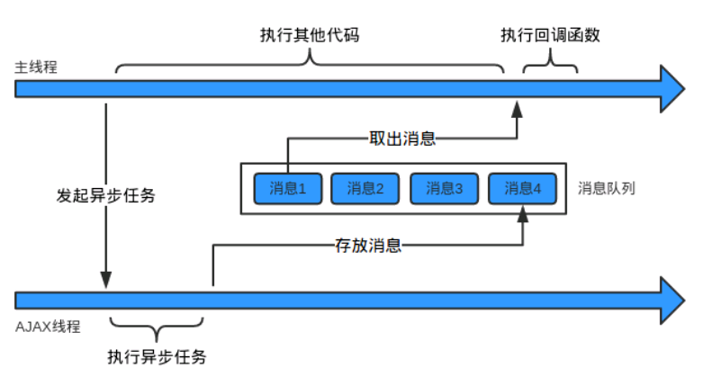
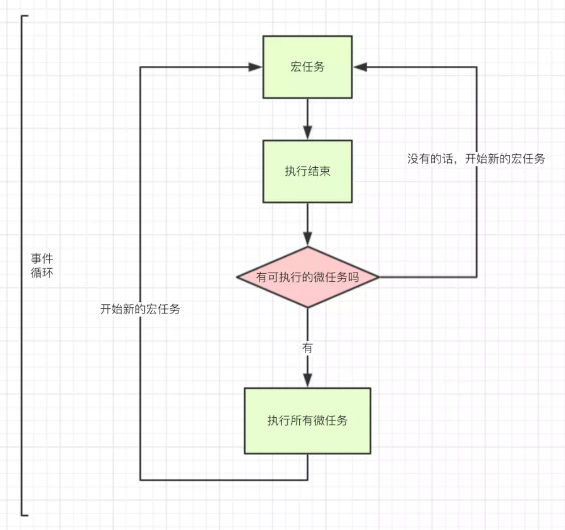

# 1.2 Call Stack(调用堆栈)

这一节就是为了熟悉js的执行机制。

## 1.2.1 调用堆栈

### Q1.堆和栈的区别？js的调用堆栈指得是什么

#### 堆heap

堆的特点是”无序”的key-value”键值对”存储方式，堆的存取方式跟顺序没有关系，不局限出入口。
在js中，引用类型被分配在一个堆中，即用以表示一大块非结构化的内存区域。


js中堆的体现最明显的就是引用类型的堆内存存储方式了。

#### 栈Stack，FILO


在js中主要指执行栈，也称调用栈，用于存储在代码执行期间创建的所有执行上下文。如下函数，它的调用形成了一个栈帧：

``` js
function foo(b) {
  var a = 10;
  return a + b + 11;
}

function bar(x) {
  var y = 3;
  return foo(x * y);
}

console.log(bar(7)); // 返回 42
```

当调用 bar 时，创建了第一个帧（调用帧, call frame） ，帧中包含了 bar 的参数和局部变量。当 bar 调用 foo 时，第二个帧就被创建，并被压到第一个帧之上，帧中包含了 foo 的参数和局部变量。所有的调用帧形成了一个调用栈（call stack）。当 foo 返回时，最上层的帧就被弹出栈（剩下 bar 函数的调用帧 ）。当 bar 返回的时候，栈就空了。


### Q2.调用堆栈是否有限制，如果有，具体限制是什么？如何避免呢

答：可想而知，当事件帧一直被创建而没有弹出销毁时，总有一刻会发生调用栈的溢出。每个执行环境的调用栈极限不同，可用如下方法进行测试：
``` js
let callNum = 0;
function endlessRun () {
  callNum++;
  endlessRun();
}
try {
  endlessRun();
} catch (e) {
  console.log(`max: ${callNum}`);	// max: 15721
}
```

#### 避免溢出

首先，通常导致调用栈溢出的原因是因为递归函数调用得不到终止，调用栈一直累加，因此首先要考虑的就是避免递归，通常的做法是将递归改为循环遍历，正如“所有递归都可以用循环实现”所说。还有一种递归的优化就是下一题（1.2.2 Q2）的尾递归，在此不做介绍。

其次，可以利用宏任务的setTimeout，保证调用栈不会一直被累加。该方式有其他内存以及性能的消耗故本人不是很推荐。


## 1.2.2 递归和尾递归

### Q1.什么是递归？递归会有隐患吗

> 程序调用自身的编程技巧称为递归（recursion）。

类似于德罗斯特效应（Droste effect），它是递归的一种视觉形式，是指一张图片的某个部分与整张图片相同，如此产生无限循环。


#### 递归的特点：
- 1. 子问题须与原始问题为同样的事，且更为简单；
- 2. 不能无限制地调用本身，须有个出口，化简为非递归状况处理。

递归算法一般用于解决三类问题：
- 1. 数据的定义是按递归定义的。（Fibonacci函数）
- 2. 问题解法按递归算法实现。这类问题虽则本身没有明显的递归结构，但用递归求解比迭代求解更简单，如Hanoi问题。
- 3. 数据的结构形式是按递归定义的。如二叉树、广义表等，由于结构本身固有的递归特性，则它们的操作可递归地描述。

#### 递归的缺点：
递归算法解题相对常用的算法如普通循环等，运行效率较低。因此，应该尽量避免使用递归，除非没有更好的算法或者某种特定情况，递归更为适合的时候。在递归调用的过程当中系统为每一层的返回点、局部量等开辟了栈来存储。递归次数过多容易造成栈溢出等。

例：阶乘函数
``` js
function fac(n) {
  if (n === 1) return 1;
  return n * fac(n - 1);
}

fac(5) // 120
```


### Q2.什么是尾递归？它的作用是什么？能否举个例子

> 如果一个函数中所有递归形式的调用都出现在函数的末尾，我们称这个递归函数是尾递归的。当递归调用是整个函数体中最后执行的语句且它的返回值不属于表达式的一部分时，这个递归调用就是尾递归。

要说尾递归首先要说尾调用(tail call)，简单来说尾调用指某个函数的最后一步是调用另一个函数。但实际并不简单

``` js
// demo 1
function f(x){
  let y = g(x);
  return y;
}

// demo 2
function f(x){
  return g(x) + 1;
}

// demo 3
function f(x){
  g(x);
}
```

以上三个demo均不是尾调用。可能demo 3会有点难以理解，不过换成如下写法就明白了，demo 3跟它是等价的：
``` js
function f(x) {
	g(x);
	return undefined;
}
```

递归非常耗费内存，因为需要同时保存成千上百个调用帧，很容易发生“栈溢出”错误（stack overflow）。
尾调用由于是函数的最后一步操作，所以不需要保留外层函数的调用帧，因为调用位置、内部变量等信息都不会再用到了，只要直接用内层函数的调用帧，取代外层函数的调用帧就可以了。由于只存在一个调用帧，所以永远不会发生“栈溢出”错误。这个过程的优化称为尾调用优化（tail call optimization）

如：
``` js
function f() {
  let m = 1;
  let n = 2;
  return g(m + n);
}
f();

// 等同于
function f() {
  return g(3);
}
f();
```


如上述的阶乘函数：
``` js
function fac(n, total) {
  if (n === 1) return total;
  return fac(n - 1, n * total);
}

fac(5, 1) // 120
```

不过带有尾递归优化的环境当前还是较少的，可通过[compat-table/es6 tail call optimization](http://kangax.github.io/compat-table/es6/)查看兼容性详情。


## 1.2.3 异步与回调

### Q1.js实现异步的方式和场景有哪些？

答：异步（Synchronization）通常的实现方式为多线程或单线程非阻塞，js的异步实现就是采用单线程非阻塞式的方式。

js的异步方式：

#### setTimeout和setInterval
web api，不解释。

#### Promise
为了解决回调地狱的代码现象，ES6中加入了一个新的对象Promise，它提供了一种更合理、更强大的异步解决方案。

#### 异步处理――async和await
async是生成器(generator)的一种语法糖，简化了外部执行器的代码，同时利用await替代yield，async也替代了生成器的`*`号，它的实质是对异步操作方式的简化处理。

场景：
- 延迟执行
- 资源请求、ajax
- 防止阻塞渲染
- DOM事件的执行栈
- 文件流读写

### Q2.什么是回调，你知道回调地狱么？如何解决回调地狱的问题

#### 回调
> A callback is a function that is passed as an argument to another function and is executed after its parent function has completed.

函数是“一等公民”，回调函数是作为参数传递给另一个函数的函数，然后在外部函数内调用该函数以完成某种例程或操作。一个回调函数，也被称为高阶函数。在js中的异步操作，我们经常会大量使用异步回调。如：

``` js
setTimeout(function () {
	a();
}, 2000);
```

实际业务代码中，为了实现某些逻辑会用到函数嵌套，但是嵌套过多会形成一个回调地狱，影响对代码的理解以及可读性。如：
``` js
setTimeout(function () {
	a();
	
	setTimeout(function () {
		b();
		
		setTimeout(function () {
			c();
		}, 1000)
	}, 1000);
}, 2000);
```

解决回调地狱的方法有很多，如Promise，采用链式的then通过异步操作实现按顺序从上至下进行。上一个then里的回调函数返回一个promise对象，下一个then的回调函数会等上一个then里的函数返回的promise对象状态发生变化，才会被调用。


### Q3.你知道Promise吗？那await/async呢？那generator函数呢？有了解过它们babel转为ES5后是啥样的么

答：Promise(ES6)就是为了解决异步回调地狱的问题，await/async(ES7)则是优化Promise操作的语法糖。

Promise在此就不过多介绍，async 函数就是 Generator 函数的语法糖。关注点聚集到generator函数，它是ES6提供的一种异步编程解决方案。执行 Generator 函数会返回一个遍历器对象，调用 Generator 函数，返回一个遍历器对象，代表 Generator 函数的内部指针。以后，每次调用遍历器对象的 next 方法，就会返回一个有着 value 和 done 两个属性的对象。value 属性表示当前的内部状态的值，是 yield 表达式后面那个表达式的值；done 属性是一个布尔值，表示是否遍历结束。

它的使用如：
``` js
function* helloWorldGenerator() {
  yield 'hello';
  yield 'world';
  return 'ending';
}

var hw = helloWorldGenerator();
hw.next(); // { value: 'hello', done: false }

hw.next(); // { value: 'world', done: false }

hw.next(); // { value: 'ending', done: true }

hw.next(); // { value: undefined, done: true }
```

async 函数返回一个 Promise 对象，可以使用 then 方法添加回调函数。当函数执行的时候，一旦遇到 await 就会先返回，等到异步操作完成，再接着执行函数体内后面的语句。

正常情况下，await 命令后面是一个 Promise 对象，返回该对象的结果。如果不是 Promise 对象，就直接返回对应的值。另一种情况是，await 命令后面是一个 thenable 对象（即定义 then 方法的对象），那么 await 会将其等同于 Promise 对象。

如：
``` js
async function getStockPriceByName(name) {
  const symbol = await getStockSymbol(name);
  const stockPrice = await getStockPrice(symbol);
  return stockPrice;
}

getStockPriceByName('goog').then(function (result) {
  console.log(result);
});
```

编译转为ES5：通常思路就是通过使用 generator 函数和 yield 关键字重写 async/await。如

比如：
``` js
// 编译前
function delay(ms) {
  return new Promise(function(resolve) {
    setTimeout(resolve, ms);
  })
}

async function asyncAwait () {
  console.log('step 1');

  await delay(1000);

  console.log('step 2')

  await delay(1000);

  console.log('step 3');
}
```

``` js
// 编译后
var __awaiter = (this && this.__awaiter) || function (thisArg, _arguments, P, generator) {
    return new (P || (P = Promise))(function (resolve, reject) {
        function fulfilled(value) { try { step(generator.next(value)); } catch (e) { reject(e); } }
        function rejected(value) { try { step(generator["throw"](value)); } catch (e) { reject(e); } }
        function step(result) { result.done ? resolve(result.value) : new P(function (resolve) { resolve(result.value); }).then(fulfilled, rejected); }
        step((generator = generator.apply(thisArg, _arguments)).next());
    });
};
function delay(ms) {
    return new Promise(function (resolve) {
        setTimeout(resolve, ms);
    });
}
function asyncAwait() {
    return __awaiter(this, void 0, void 0, function* () {
        console.log('step 1');
        yield delay(1000);
        console.log('step 2');
        yield delay(1000);
        console.log('step 3');
    });
}
```

而generator函数其实也可以通过编译器转化为ES3，这样也就避免了部分兼容问题。

最后附加这些特性在移动端的兼容情况：
- Promise: ios8起, android 4.4.3起；
- Generator: ios 10起, android 4.4.4以上；
- async/await: ios 11起, android 5起

## 1.2.4 消息队列

### Q1.js中的消息队列是怎么样的？

答：FIFO，里面存放这各种消息。消息队列里面存放的东西，可以暂时性理解为就是我们注册的回掉函数（回调和异步过程的回调有区别，回调一般是传入到一个函数的函数，比如A(B)，前提是B是一个函数，异步是指将来会运行“一个取自事件队列的函数”的函数），当然具体的结构跟具体的实现有关。



### Q2.什么是宏任务？什么是微任务

答：在js中，有两类任务队列：**宏任务队列（macro tasks）**和**微任务队列（micro tasks）**。宏任务队列可以有多个，微任务队列只有一个。
- 宏任务：script（全局任务）, setTimeout, setInterval, setImmediate, I/O, UI rendering。

api | 浏览器 | Nodejs
--- | ------ | ------
setTimeout | √ | √
setInterval | √ | √
setImmediate | x | √
requestAnimationFrame | √ | x

- 微任务：process.nextTick, Promise, Object.observer, MutationObserver。

api | 浏览器 | Nodejs
--- | ------ | ------
process.nextTick | x | √
MutationObserver | √ | x
Promise.then catch finally | √ | √

## 1.2.5 事件循环

### Q1.下面的执行代码依次输出什么？

``` html
<body>
<script>
console.log('a1');
setTimeout(function () {
	console.log('a2')
}, 0);
new Promise((resolve) => {
	console.log('a3');
	setTimeout(function () {
		console.log('a4')
	}, 0);
	resolve();
}).then(() => {
	console.log('a5')
});
console.log('a6');
</script>

<script>
console.log('b1');
setTimeout(function () {
	console.log('b2')
}, 0);
new Promise((resolve) => {
	console.log('b3');
	setTimeout(function () {
		console.log('b4')
	}, 0);
	resolve();
}).then(() => {
	console.log('b5')
});
console.log('b6');
</script>
</body>
```

答：`a1 a3 a6 a5 b1 b3 b6 b5 a2 a4 b2 b4`

值得注意的是，`<script>`标签内的微任务执行完成后才会执行后续代码，即`a5` -> `b1`，



### Q2.简单描述下事件循环的机制，浏览器环境与nodejs环境下的事件循环有区别吗？

#### 浏览器的 Event Loop
在浏览器中，”任务队列”中的事件，除了IO设备的事件以外，还包括一些用户产生的事件（比如鼠标点击、页面滚动等等）。只要指定过回调函数，这些事件发生时就会进入”任务队列”，等待主线程读取。

当stack空的时候，就会从任务队列中，取任务来执行。浏览器这边，共分3步：

- 1.执行完主执行线程中的任务后，取出 Microtask Queue 中任务执行直到清空，下一步。
- 2.取出 Macrotask Queue 来执行。执行完毕后，下一步。
- 3.取出 Microtask Queue 来执行，执行完毕后，再取一个微任务来执行。直到微任务队列为空，执行下一步。更新UI渲染。
- Event Loop 会无限循环执行上面第2、3步，这就是Event Loop的主要控制逻辑。

即为同步完成，一个宏任务，所有微任务，一个宏任务，所有微任务……

浏览器中的任务源非常宽泛，比如ajax的onload，click事件，基本上我们经常绑定的各种事件都是任务源，还有数据库操作（IndexedDB），需要注意的是setTimeout、setInterval、setImmediate也是任务源。总结来说：setTimeout、setInterval、setImmediate、I/O、UI rendering。


#### NodeJs 的 Event Loop

NodeJs的运行机制如下：
- 1.V8引擎解析js脚本。
- 2.解析后的代码，调用 Node API。
- 3.libuv库负责 Node API 的执行。它将不同的任务分配给不同的线程，形成一个Event Loop（事件循环），以异步的方式将任务的执行结果返回给V8引擎。
- 4.V8引擎再将结果返回给用户。

具体到事件，NodeJs 的运行是这样的：
- 1.初始化 Event Loop
- 2.执行您的主代码。这里同样，遇到异步处理，就会分配给对应的队列。直到主代码执行完毕。
- 3.执行主代码中出现的所有微任务：先执行完所有nextTick()，然后在执行其它所有微任务。
- 4.开始 Event Loop

NodeJs 的 Event Loop 分6个阶段执行：

```
   ┌───────────────────────────┐
┌─>│           timers          │
│  └─────────────┬─────────────┘
│  ┌─────────────┴─────────────┐
│  │     pending callbacks     │
│  └─────────────┬─────────────┘
│  ┌─────────────┴─────────────┐
│  │       idle, prepare       │
│  └─────────────┬─────────────┘      ┌───────────────┐
│  ┌─────────────┴─────────────┐      │   incoming:   │
│  │           poll            │<─────┤  connections, │
│  └─────────────┬─────────────┘      │   data, etc.  │
│  ┌─────────────┴─────────────┐      └───────────────┘
│  │           check           │
│  └─────────────┬─────────────┘
│  ┌─────────────┴─────────────┐
└──┤      close callbacks      │
   └───────────────────────────┘
```

总的来说，浏览器和Node 环境下，Microtask 任务队列的执行时机不同：
- Node端，Microtask 在事件循环的各个阶段之间执行；
- 浏览器端，Microtask 在事件循环的 Macrotask 执行完之后执行。

## 1.2.6 Memoization

### Q1.Memoization是什么？

答：memoization 是一种优化技术，主要用于通过存储昂贵的函数调用的结果来加速计算机程序，并在再次发生相同的输入时返回缓存的结果。

比如实现方法：
``` js
/**
 * @function memoize
 * @param {function} fn 
 */
function memoize (fn) {
    const cache = new Map();
    const cached = function (val) {
        return cache.has(val) ? cache.get(val) : cache.set(val, fn.call(this, val)) && cache.get(val);
    };
    cached.cache = cache;
    return cached;
}
```

### Q2.Memoization的应用场景是什么？

答：需要提升运算速度的场景，比如一些涉及到递归的运算，Fibonacci数列。或一些根据环境等来定义变量或方法的方法。如
``` js
function say() {
	if (~navigator.userAgent.toLowerCase().indexOf('iphone')) {
		console.log('iphone')
	} else {
		console.log('not iphone')
	}
}
```

每次调用say()方法都会进行判断处理，可改为
``` js
const say = memoize(function () {
	if (~navigator.userAgent.toLowerCase().indexOf('iphone')) {
		return () => console.log('iphone');
	} else {
		return () => console.log('not iphone');
	} 
})();
```

判断只在初始化的过程中执行一次。


------------------
反馈和转载请联系作者：[michealwayne@163.com](mailto:michealwayne@163.com)
